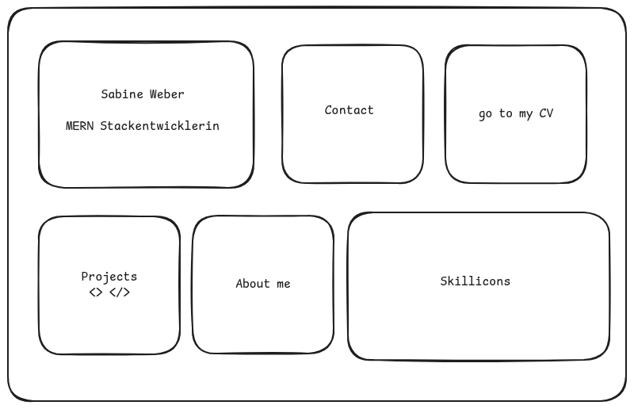

# Portfolio README

## Beschreibung

Das Portfolio zeigt meine Fähigkeiten in Webentwicklung, Design und Projektmanagement. Es besteht aus verschiedenen Kacheln, die unterschiedliche Inhalte anbieten.



## Projektplanung

- **Thema**: Portfolio mit unterschiedlichen Kacheln
- **Zielgruppe**: Arbeitgeber, Kunden und andere Interessierte, die meine Arbeiten sehen möchten.

## Projekte

- **Herausforderung**: Die Projekte sind derzeit lokal oder in öffentlichen GitHub-Repositories gespeichert und können nicht extern verlinkt werden. Es wurde mit:
  - **Git-Submodule**: Verwenden von Git-Submodulen, um Projekte als separate Repositories zu verwalten.
  - **Online**: Verwendung der bereits Onlinegestellten Projekte.

## Technologiestack

- **Frontend**: React, React Router
- **State Management**: Context API

## Design und Benutzeroberfläche

- **CSS-Design**: selbst geschrieben und mit Unterstützung der Blackbox AI komplementiert
- **Responsive Design**: Für verschiedene Bildschirmgrößen und Geräte
- **Benutzerfreundlichkeit**: Benutzerfreundliche Navigation und leicht zugängliche Inhalt
- **Farbschema**: Einheitliches Farbschema für die gesamte Anwendung verwendete Farbcodes:

## Entwicklung

- **Komponenten**:
  - **Projekt-Kachel**:
    - **Beschreibung**: Die Projekt-Kachel enthält eine Unterseite mit einem Carousel, das alte Projekte mit einer Galerie und einem Vorschaubild anzeigt.
    - **Carousel**:
      - **Beschreibung**: Das Carousel zeigt alte Projekte mit einer Galerie und einem Vorschaubild an.
      - **Funktionalität**: Die Projekte können durchgeklickt werden, um weitere Informationen zu erhalten.
  - **Contact-Kachel**:
    - **Beschreibung**: Die Contact-Kachel enthält ein Formular, mit dem Besucher Kontakt aufnehmen können.
  - **CV-Kachel**:
    - **Beschreibung**: Die CV-Kachel enthält Tabellen mit wichtigen Eckdaten zu meinem Lebenslauf und kleine Vorschaubilder von meinen Zeugnissen.
    - **Funktionalität**: Die Zeugnisse können separat geöffnet werden, wenn man sie anklickt.
  - **Grid-Komponente**: Steuert das Layout der Kacheln (2-1, 1-1, 1-1 in der ersten Reihe und 1-1, 1-1, 2-1 in der zweiten Reihe).
  - **MouseOver-Effekt für 2-1 Kacheln**:
    - **Beschreibung**: Die 2-1 Kacheln haben keinen Button-Effekt, aber beim Überfahren mit der Maus (MouseOver) vergrößern sie sich um ein paar REM.
  - **Sprachumschalter**:
    - **Beschreibung**: Ein Toggle-Switch ermöglicht die Auswahl zwischen Deutsch und Englisch. Der aktuelle Sprachstatus wird global verwaltet, sodass er in allen Komponenten verfügbar ist.
    - **Implementierung**:
      - Ein `LanguageToggle`-Komponente wird erstellt, um zwischen den Sprachen zu wechseln.
      - Der Zustand der Sprache wird mithilfe des Context API verwaltet, um die Sprache in der gesamten Anwendung zu teilen.
  - **Back to Home Button**:
    - **Beschreibung**: Ein Button, der es Benutzern ermöglicht, zur Hauptseite des Portfolios zurückzukehren.
    - **Implementierung**:
      - Der Button kann in den Projekt-Kacheln oder auf den Detailseiten platziert werden, um eine einfache Navigation zu gewährleisten.
      - Verwendung von React Router für die Navigation zurück zur Startseite.

## Dokumentation

- **README**: Diese Datei wird kontinuierlich aktualisiert, um die Entwicklung und Nutzung des Portfolios zu dokumentieren.

**Ordnerstruktur**

```
vite-project/
│ ├── src/
│ ├── assets/
│ │ └── react.svg
│ │ │ ├── components/
│ │ ├── buttons/
│ │ │ ├── BackToHome.jsx
│ │ │ └── LanguageSwitch.jsx
│ │ │ │ │ ├── carousel/
│ │ │ └── Carousel.jsx
│ │ │ │ │ └── tiles/
│ │ ├── CVTile.jsx
│ │ ├── ContactTile.jsx
│ │ ├── AboutmeTile.jsx
│ │ ├── ProjectTile.jsx
│ │ ├── IconTile.jsx
│ │ └── MainTile.jsx
│ │ │ ├── pages/
│ │ ├── AboutMe.jsx
│ │ ├── Project.jsx
│ │ ├── CV.jsx
│ │ └── Contact.jsx
│ │ │ ├── styles/
│ │ ├── carousel.css
│ │ ├── tile.css
│ │ ├── pagesStyling.css
│ │ ├── backToHomeButton.css
│ │ └── languageSwitchButton.css
│ │ │ ├── utils/
│ │ └── linksToProjects.js
│ │ │ ├── App.jsx
│ ├── App.css
│ ├── index.css
│ ├── main.jsx
│ └── router.jsx
│ ├── public/
│ └── vite.svg
│ ├── .gitignore
├── README.md
├── index.html
├── vite.config.js
├── eslint.config.js
└── package.json
```

21.10.2024

### FontAwesome in React

#### Installation

Um FontAwesome in einem React-Projekt zu verwenden sind folgende Schritten notwenig:

1. Installation der notwendigen FontAwesome-Pakete:

```bash
npm install @fortawesome/fontawesome-svg-core
npm install @fortawesome/free-solid-svg-icons
npm install @fortawesome/react-fontawesome
npm install @fortawesome/free-regular-svg-icons
npm install @fortawesome/free-brands-svg-icons
```

2. Importiert der FontAwesome-Komponenten an einem Beispiel

```
import React from 'react';
import { Link } from 'react-router-dom';
import { FontAwesomeIcon } from '@fortawesome/react-fontawesome';
import { faUser } from '@fortawesome/free-solid-svg-icons';
import '../../Styling/tile.css';

const AboutMeTile = () => {
  return (
    <Link to="/about-me" className="tile about-me-tile">
      <div className="tile-content">
        <FontAwesomeIcon icon={faUser} className="tile-icon" />
        <h2>About Me</h2>
      </div>
    </Link>
  );
};

export default AboutMeTile;
```

### Komponenten

- `App.jsx`: Hauptkomponente, die als Layout dient und die Navigation enthält.
- Tile-Komponenten:
  - `AboutmeTile.jsx`: Implementiert (weitere Tiles in Entwicklung)
- Seitenkomponenten:
  - `Aboutme.jsx`
  - `Project.jsx`
  - `CV.jsx`
  - `Contact.jsx`

### Routing

- Router-Konfiguration in `router.jsx`
- Hauptrouten:
  - `/`: Hauptseite
  - `/aboutme`: Über mich
  - `/projects`: Projekte
  - `/cv`: Lebenslauf
  - `/contact`: Kontakt

### Entwicklungsfortschritt

1. Implementierung der HoverableTileSmall Komponente

   - Erstellung einer wiederverwendbaren Komponente für kleine, hover-fähige Kacheln
   - Integration von React Router für Navigation
   - Implementierung eines Hover-Effekts mit useState

2. Anpassung der AboutmeTile und ContactTile Komponenten

   - Verwendung der HoverableTileSmall als Basis
   - Integration von FontAwesome Icons
   - Anpassung des Stylings basierend auf dem Hover-Zustand

3. Aktualisierung der App.jsx

   - Integration der AboutmeTile und ContactTile in die Hauptnavigation
   - Verwendung des React Router Outlet für dynamisches Rendering von Unterseiten

4. Erstellung der Aboutme Seite

   - Implementierung des Seiteninhalts mit Überschriften und Textabschnitten
   - Integration des LanguageSwitch und BackToHomeButton

5. Aktualisierung des React Routers

   - Definition der Routen für die Hauptanwendung und Unterseiten

6. Styling der Komponenten

   - Erstellung einer tile.css für das Styling der Kacheln
   - Implementierung von responsivem Design
   - Festlegung von Farben, Größen und Hover-Effekten

7. Debugging und Testing
   - Überprüfung der korrekten Darstellung im Frontend
   - Testen der Navigation und Hover-Effekte

### Nächste Schritte

- Implementierung der verbleibenden Kacheln und Seiten (CV, Projects)
- Vollständige Integration des Sprachumschalters
- Feinabstimmung des responsiven Designs
- Implementierung des BackToHome-Buttons auf allen Unterseiten
- Durchführung von umfassenden Tests auf verschiedenen Geräten und Browsern


22.10.2024

### Entwicklungsfortschritt

### Implementierung der Tile-Komponenten

1. Entwicklung von zwei wiederverwendbaren Hover-Komponenten:

- HoverableTileBig für 2:1 Kacheln (MainTile, IconTile)
- HoverableTileSmall für 1:1 Kacheln (AboutMe, Contact, CV, Projects)
- Integration von Hover-Effekten mit unterschiedlichen Skalierungen
- Implementierung der Navigation mittels React Router
  FontAwesome Integration

2. Erfolgreiche Einbindung von FontAwesome-Icons:

- Verwendung verschiedener Icon-Typen (solid, brands) für unterschiedliche Tiles
- Dynamische Farbanpassung der Icons basierend auf Hover-Status
  Komponenten-Struktur

3. Hauptkomponenten implementiert:

- MainTile (mit MERN-Stack Logo)
- AboutmeTile (mit Routing zur About-Seite)
- ContactTile (mit Kontaktformular)
- ProjectsTile (mit Projektverweis)
- IconsTile (Skills-Übersicht)
- CVTile (Lebenslauf-Verweis)
- Routing-System

4. Implementierung des React Router Systems:

- Integration des Outlet-Components in App.jsx
- Einrichtung der Navigationslogik für alle Tiles
  Styling

5. Entwicklung eines einheitlichen Styling-Konzepts

- Implementierung von responsivem Design
- Dynamische Farbänderungen bei Hover-Effekten
- Übergangsanimationen für bessere Benutzerinteraktion

### Nächste Schritte

Vollständige Implementierung des Sprachumschalters
Fertigstellung des Kontaktformulars
Integration des Projekt-Carousels
Implementierung des BackToHome-Buttons
Feinabstimmung des responsiven Designs
Diese Zusammenfassung zeigt die wichtigsten Entwicklungsfortschritte und gibt einen Überblick über die nächsten geplanten Schritte.


23.10.2024

### Entwicklungsfortschritt

nice to do - responsiv design zusammenfassen
nice to have - hintergrund im header auf den pages
Review und Anpassung der Media Queries

1. Identifizierung vorhandener Media Queries in verschiedenen Komponenten

- Analyse der Breakpoints (768px und 480px)
- Erweiterung der Media Queries für aboutmePage.css

2. AboutMe-Seite

- Grundstruktur implementiert
- Vorbereitung für zweisprachige Inhalte
- Media Queries für responsive Darstellung angepasst

### Nächste Schritte

1. AboutMe-Seite fertigstellen:

- Inhalte einfügen (DE/EN)
- Foto einbinden
- Styling optimieren
- Responsive Design testen
- Sprachumschaltung:

2. LanguageSwitch-Komponente fertigstellen

- Integration in AboutMe-Seite
- Testing der Sprachumschaltung

3. Nice-to-have Liste:

- Standardisierung der Media Queries über alle Komponenten
- Hintergrund im Header auf den Pages anpassen
- Responsives Design zusammenfassen und vereinheitlichen
- Flaggen statt Sprachcodes verwenden

4. Testing:

- Funktionstest auf verschiedenen Bildschirmgrößen
- Überprüfung der Sprachumschaltung
- Test der Navigation und Links

### Offene Punkte:

- Vollständige Implementierung des Sprachumschalters
- Fertigstellung des Kontaktformulars
- Integration des Projekt-Carousels
- Implementierung des BackToHome-Buttons
- Feinabstimmung des responsiven Designs


24.10.2024

### Entwicklungsfortschritt

1. Implementierung des Sprachkontexts

- Erfolgreich den LanguageProvider in die Router-Struktur integriert.
- Verwendung von createBrowserRouter für das Routing-System beibehalten.
- LanguageProvider umschließt nun den gesamten RouterProvider, um globalen Zugriff auf den Sprachkontext zu ermöglichen.

2. Router-Konfiguration angepasst

- Aktualisierung der Router-Konfiguration zur Integration des `LanguageProvider`.
- Beibehaltung der bestehenden Routenstruktur mit Hauptkomponenten wie App, AboutMe, CV, Contact und Projects.

3. Sprachumschaltung

- Implementierung des useLanguage-Hooks in verschiedenen Komponenten.
- Ermöglicht nun dynamisches Umschalten zwischen Sprachen in allen Komponenten.

4. AboutMe-Komponente

- Erfolgreich den useLanguage-Hook in der AboutMe-Komponente implementiert.
- Inhalte können jetzt basierend auf der ausgewählten Sprache dynamisch angezeigt werden.

5. Globale Verfügbarkeit des LanguageSwitch

- Überlegungen zur Platzierung des LanguageSwitch für globale Verfügbarkeit (z.B. in einem gemeinsamen Layout oder in der App-Komponente).

6. Codestruktur und Organisation

- Beibehaltung der bestehenden Komponentenstruktur bei gleichzeitiger Integration neuer Funktionalitäten.
- Verbesserung der Codeorganisation für einfachere Wartung und Erweiterbarkeit.


26.10.2024

## E-Mail-Funktionalität in der Kontaktseite

### Option 1: Verwendung von EmailJS

EmailJS ist ein einfacher Dienst, um E-Mails direkt von deiner Anwendung aus zu versenden, ohne einen eigenen Server zu benötigen.

#### Schritte zur Implementierung mit EmailJS:

1. **Registrierung bei EmailJS**:

   - Gehe zu [EmailJS](https://www.emailjs.com/) und erstelle ein kostenloses Konto.

2. **E-Mail-Dienst hinzufügen**:

   - Füge deinen E-Mail-Dienst (z.B. Gmail, Outlook) hinzu und erstelle eine neue E-Mail-Vorlage.

3. **Installation der EmailJS-Bibliothek**:

   - Führe den folgenden Befehl aus, um die EmailJS-Bibliothek in deinem Projekt zu installieren:
     ```bash
     npm install emailjs-com
     ```

4. **Implementierung der E-Mail-Funktionalität in der `Contact`-Komponente**:

   - Importiere die EmailJS-Bibliothek und implementiere die `handleSubmit`-Funktion in deiner `Contact`-Komponente:

   ```javascript
   import React, { useState } from 'react';
   import emailjs from 'emailjs-com'; // Importiere die EmailJS-Bibliothek

   const Contact = () => {
     const [formData, setFormData] = useState({
       fullname: '',
       email: '',
       message: '',
     });

     const handleChange = (event) => {
       const { name, value } = event.target;
       setFormData((prevState) => ({ ...prevState, [name]: value }));
     };

     const handleSubmit = (event) => {
       event.preventDefault();

       // E-Mail-Funktionalität
       emailjs
         .send('YOUR_SERVICE_ID', 'YOUR_TEMPLATE_ID', formData, 'YOUR_USER_ID')
         .then(
           (response) => {
             console.log(
               'E-Mail erfolgreich gesendet!',
               response.status,
               response.text
             );
             // Optional: Formular zurücksetzen oder eine Erfolgsmeldung anzeigen
             setFormData({ fullname: '', email: '', message: '' });
           },
           (err) => {
             console.error('E-Mail konnte nicht gesendet werden.', err);
           }
         );
     };

     return (
       <form className="contactForm" onSubmit={handleSubmit}>
         {/* Formularfelder hier */}
         <button type="submit">Senden</button>
       </form>
     );
   };

   export default Contact;
   ```

5. Implementierung des Sprachkontexts:

- Der `LanguageProvider` wurde erfolgreich in die Router-Struktur integriert, um globalen Zugriff auf den Sprachkontext zu ermöglichen.

2. Anpassung der Router-Konfiguration:

- Die Router-Konfiguration wurde aktualisiert, um den `LanguageProvider` zu integrieren, während die bestehende Routenstruktur beibehalten wurde.

3. Sprachumschaltung:

- Der `useLanguage-Hook` wurde in verschiedenen Komponenten implementiert, was nun ein dynamisches Umschalten zwischen den Sprachen in der gesamten Anwendung ermöglicht.

4. AboutMe-Komponente:

- Der `useLanguage-Hook` wurde erfolgreich in der AboutMe-Komponente implementiert, sodass die Inhalte basierend auf der ausgewählten Sprache dynamisch angezeigt werden können.

5. Globale Verfügbarkeit des LanguageSwitch:

- Überlegungen zur optimalen Platzierung des `LanguageSwitch` wurden angestellt, um eine globale Verfügbarkeit zu gewährleisten (z.B. in einem gemeinsamen Layout oder in der App-Komponente).

6. Codestruktur und Organisation:

- Die bestehende Komponentenstruktur wurde beibehalten, während neue Funktionalitäten integriert wurden, um die Codeorganisation für einfachere Wartung und Erweiterbarkeit zu verbessern.

## Nice to have

### Standardisierung der Media Queries:

- Einheitliche Anwendung von Media Queries über alle Komponenten zur Verbesserung der responsiven Darstellung.

### Hintergrund im Header anpassen:

- Implementierung eines ansprechenden Hintergrunds im Header auf den Seiten zur visuellen Aufwertung.

### Responsives Design zusammenfassen und vereinheitlichen:

- Überprüfung und Optimierung des responsiven Designs für eine konsistente Benutzererfahrung auf verschiedenen Geräten.

### Verwendung von Flaggen statt Sprachcodes:

- Implementierung von Flaggen zur Darstellung der Sprachumschaltung anstelle von Textcodes, um die Benutzerfreundlichkeit zu erhöhen.

### Feinabstimmung des Designs:

- Weitere Anpassungen und Optimierungen des Designs zur Verbesserung der Benutzeroberfläche und Benutzererfahrung.
